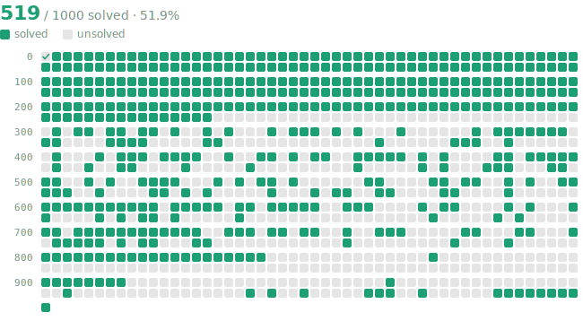

[](https://github.com/rayrwang/project-euler/actions/workflows/check-solutions.yml)

[](https://github.com/rayrwang/project-euler/actions/workflows/lint.yml) [](https://github.com/rayrwang/project-euler/actions/workflows/type-check.yml)

Claude's solutions to (almost) every Project Euler problem.

All solutions only use the Python standard library, Numpy, and Numba to speed up the code.

Everything on or before 2026 Apr 20 is done by me, after is done by Claude.

## Files

```
project-euler/
├── explanations.{typ,pdf}  # Written solutions
├── X00-X99/
	├── pXXXX.py  # Solution for Problem XXXX
	├── ...
├── funcs.py  # Functions used across solutions
└── test.py   # Run and check all solutions
```
